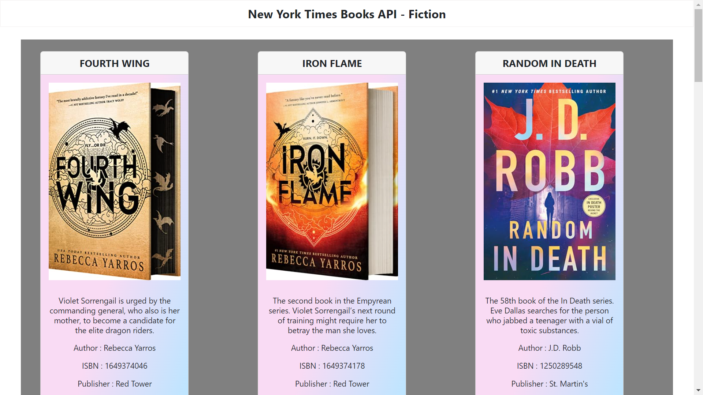

# Day-20 New York Times Books fetching from API_URL

This project is to create and display the New York Times Books details by fetching the information from the API (https://api.nytimes.com/svc/books/v3/lists/current/hardcover-fiction.json?api-key=J63QBTyu7Kzs9GKRlhoWBrGV68o4eNgO).

To view the New York Times book app in browser [Click Here](https://nyt-books-3411.netlify.app/)

 

